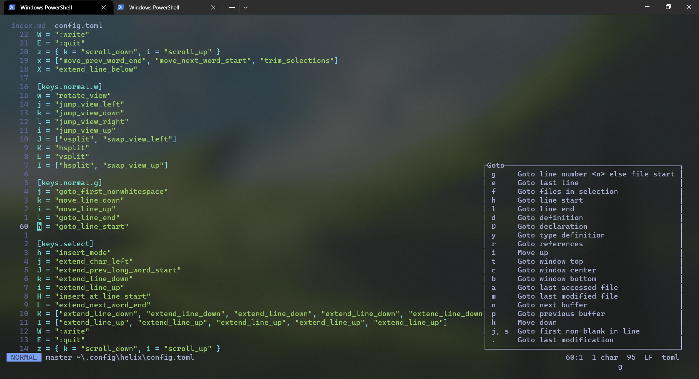
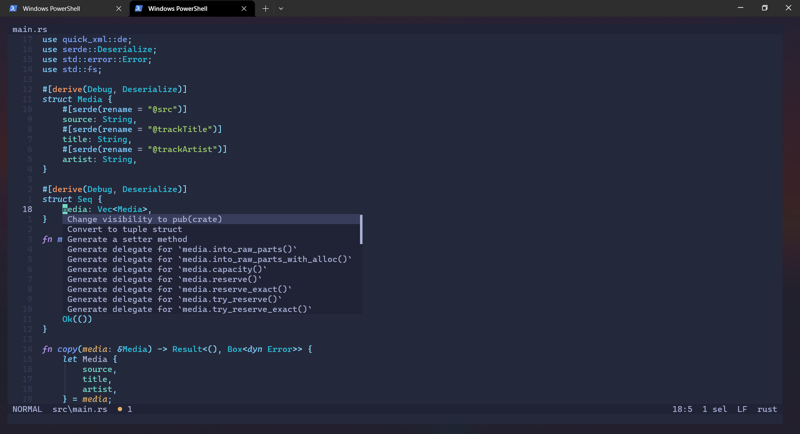

最近发现了一个用 Rust 写的 Vim-like 编辑器 Helix，用有强大的性能和各种开箱即用的功能。经过短暂时间的体验，我认为 Helix 已经可以在大部分领域替代 Vim/Neovim/VS Code。

## 性能

作为一款用 Rust 写的编辑器，Helix 自然拥有优异的性能。得益于其丰富的内置功能，Helix 无需插件就可以完成许多 Vim 只能用插件做到的事，并且还通过 Rust 获得了性能上的优势。现在我的 Neovim 安装有 `coc.nvim`、`vim-visual-multi` 等插件，共十个，启动需要延迟近 0.5 秒，虽然已经显著快于 VS Code，但相比 Helix 的小于 0.1 秒，还是稍显逊色。（当然这可能与我现在用的是 Windows 有关）

虽然现在（2023年4月8日）Helix 还没有插件系统，但未来的插件系统大概率会用 WASM 实现，相比 Vim Script 以及 Neovim 用的 Lua 等脚本语言会更快。

## 编辑体验

### 整体思路

首先 Helix 和 Vim 一样都是模态编辑器，具有多种模式，最基本的操作思路是一样的，比如都使用 `hjkl` 进行移动，都使用 `i`、`a` 等进行插入，都使用 `y`，`d`、`p` 进行复制删除粘贴。但是 Helix 采用了 `selection -> action` 模式，比如向右删除 3 个字符需要按 `3ld` 而不是 `d3l`，先选择在操作，就我个人而言，这种方式确实更舒适。

另外，Helix 的命令有丰富的提示，而且还可以通过 `<space> ?` 打开命令面板查找命令，并带有相关键位提示，包括自定义的键位。



### 配置文件

Helix 使用了 TOML 作为配置文件格式，以声明式代替了 Vim Script 的命令式。

所有的默认配置均可在[此处](https://docs.helix-editor.com/configuration.html)找到。以下是我的（主）配置文件 `~/.config/helix/config.toml`：

```toml
theme = "tokyonight_storm"

[editor]
line-number = "relative" # 相对行号
completion-trigger-len = 1 # 触发自动补全的最少字符数
bufferline = "always" # 顶部显示的标签页
idle-timeout = 0 # 立刻触发自动补全
color-modes = true

# 底部状态栏
[editor.statusline]
left = ["mode", "spacer", "version-control", "file-name", "spinner", "diagnostics"]
right = ["position", "primary-selection-length", "total-line-numbers", "file-encoding", "file-line-ending", "file-type"]

[editor.statusline.mode]
normal = "NORMAL"
insert = "INSERT"
select = "SELECT"

# 光标设置
[editor.cursor-shape]
normal = "block"
insert = "bar"
select = "block"

# 缩进提示线
[editor.indent-guides]
render = true
skip-levels = 1

[keys.normal]
h = "insert_mode"
j = "move_char_left"
J = "move_prev_long_word_start"
k = "move_line_down"
i = "move_line_up"
H = "insert_at_line_start"
L = "move_next_word_end"
K = ["move_line_down", "move_line_down", "move_line_down", "move_line_down", "move_line_down"]
I = ["move_line_up", "move_line_up", "move_line_up", "move_line_up", "move_line_up"]
W = ":write"
E = ":quit"
z = { k = "scroll_down", i = "scroll_up" }
x = ["move_prev_word_end", "move_next_word_start", "trim_selections"]
X = "extend_line_below"

[keys.normal.w]
w = "rotate_view"
j = "jump_view_left"
k = "jump_view_down"
l = "jump_view_right"
i = "jump_view_up"
J = ["vsplit", "swap_view_left"]
K = "hsplit"
L = "vsplit"
I = ["hsplit", "swap_view_up"]

[keys.normal.g]
j = "goto_first_nonwhitespace"
k = "move_line_down"
i = "move_line_up"
l = "goto_line_end"
h = "goto_line_start"

[keys.select]
h = "insert_mode"
j = "extend_char_left"
J = "extend_prev_long_word_start"
k = "extend_line_down"
i = "extend_line_up"
H = "insert_at_line_start"
L = "extend_next_word_end"
K = ["extend_line_down", "extend_line_down", "extend_line_down", "extend_line_down", "extend_line_down"]
I = ["extend_line_up", "extend_line_up", "extend_line_up", "extend_line_up", "extend_line_up"]
W = ":write"
E = ":quit"
z = { k = "scroll_down", i = "scroll_up" }
x = ["move_prev_word_end", "move_next_word_start", "trim_selections"]
X = "extend_line_below"

[keys.select.w]
w = "rotate_view"
j = "jump_view_left"
k = "jump_view_down"
l = "jump_view_right"
i = "jump_view_up"
J = ["vsplit", "swap_view_left"]
K = "hsplit"
L = "vsplit"
I = ["hsplit", "swap_view_up"]

[keys.select.g]
j = "goto_first_nonwhitespace"
k = "extend_line_down"
i = "extend_line_up"
l = "goto_line_end"
h = "goto_line_start"
```

我的看起来还是比较长，这是因为我习惯用 `jkli` 代替 `hjkl` 进行移动，协调各个键位还是比较麻烦，但是仍然是可以接受的。

当然，目前 Helix 还不支持 macro-style 的键位映射，所以键位不可以映射为其他按键，只能调用内置命令，因此部分功能还是比较难实现的，这也是每一行都比较长的原因。

接下来我也会分开讲讲配置。

### 光标移动

```toml
[keys.normal]
h = "insert_mode"
j = "move_char_left"
J = "move_prev_long_word_start"
k = "move_line_down"
i = "move_line_up"
H = "insert_at_line_start"
L = "move_next_word_end"
K = ["move_line_down", "move_line_down", "move_line_down", "move_line_down", "move_line_down"]
I = ["move_line_up", "move_line_up", "move_line_up", "move_line_up", "move_line_up"]
```

主要就是把 `jkli` 按照其在键盘上所处的位置映射相关方向的移动命令，再用 `h` 实现原来的 `i` 的功能。

为了记忆简单，我把原来的 `w` 和 `e` 的功能移到了 `J` 和 `L` 上。然后把 `K` 映射为原来的 `5j`, `I` 映射为原来的 `5k`，这样也比较方便快速地中等距离移动。

### 窗口及标签操作

```toml
[keys.normal.w]
w = "rotate_view" # 按顺序在窗口中切换
j = "jump_view_left"
k = "jump_view_down"
l = "jump_view_right"
i = "jump_view_up"
J = ["vsplit", "swap_view_left"]
K = "hsplit"
L = "vsplit"
I = ["hsplit", "swap_view_up"]
```

Helix 的原本的窗口操作是以 `Ctrl-w` 为前缀，并且接下来的选项众多，也不够方便指定方向分割出窗口，于是我自己定义了一套，方便记忆，以 `w` 开头，小写代表切换，大小代表创建。

至于标签页，可以用 `:n` 或 `:new` 来创建一个新的标签/Buffer，用 `:bc` 或 `:buffer-close` 来关闭，切换操作见下一节。

### 跳转操作

跳转操作以 `g` 为前缀，大致与 Vim 类似，但跳转至行首行尾不再是 `0` 或 `$`，而是 `gh` 与 `gl`。标签页切换用 `gn` 或 `gp`，分别表示向前或向后。

跳转同样支持 Go to iefinition/implementation/references 等操作，只要有 LSP 支持。

更多操作可以参考[这里](https://docs.helix-editor.com/keymap.html#goto-mode)。

以下配置与上面的配置思路保持一致：

```toml
[keys.normal.g]
j = "goto_first_nonwhitespace"
k = "move_line_down"
i = "move_line_up"
l = "goto_line_end"
h = "goto_line_start"
```

### 选择操作与多光标

先说多光标，Helix 可以通过 `C` 和 `Shift-Alt-c` 来分别向下和向上扩展一个光标，类似 VS Code 中的 `Ctrl-Alt-<up>/<down>`，如果想要取消多个光标，只保留最后一个，可以按 `,`（注意不是 `Esc`）。

Helix 自带非常强大的多光标与多项选择功能，接下来的操作则更为强大。

首先，Helix 拥有许多选择操作，比如可以通过 `x` 来进行行选择，每按一次则扩展一行，也可以通过 `%` 选中整个文件，还可以用 `s` 来选中选区内的指定内容，通过正则表达式来匹配。比如我通过 `x` 选中了若干行，然后我想选择这几行中所有的数字，在每一处加一个光标，只需按一下 `s`，然后在屏幕底部的 `select:` 后输入 `[0-9]+` 再按 `Enter` 就完成了选中。

接着是 SELECT 模式，其相当于 Vim 中的 VISUAL 模式，任何移动光标的操作都可以扩展选区，包括跳转。为什么没有 VISUAL-LINE 模式呢？因为只要在 SELECT 模式下按 `x` 就可以了。那 VISUAL-BLOCK 呢？多光标就可以解决这个问题，直接创建一列光标，然后左右移动即可。这样带来的好处就是简单且高效，想要同时编辑多行，只要像编辑一行一样处理即可，无需使用奇怪的 `:'<,'>norm <some commands>` 来实现。

以上两种可以结合使用，灵活性很高，读者可以根据[文档](https://docs.helix-editor.com/keymap.html#selection-manipulation)开发出更多的用法。

我自己把 `x` 换成了选中单词，`X` 换成选中行。

需要注意的是，如果要像我一样更改键位，SELECT 模式下的光标移动命令就不再是 `move_*`，而是 `extend_*`，所以要像下面这样稍做改动：

```toml
# 注意是 keys.select
[keys.select]
h = "insert_mode"
j = "extend_char_left"
J = "extend_prev_long_word_start"
k = "extend_line_down"
i = "extend_line_up"
H = "insert_at_line_start"
L = "extend_next_word_end"
K = ["extend_line_down", "extend_line_down", "extend_line_down", "extend_line_down", "extend_line_down"]
I = ["extend_line_up", "extend_line_up", "extend_line_up", "extend_line_up", "extend_line_up"]
z = { k = "scroll_down", i = "scroll_up" }
x = ["move_prev_word_end", "move_next_word_start", "trim_selections"]
X = "extend_line_below"

# 之前定义的是在 NORMAL 模式下的窗口操作，现在要重新设置一遍
[keys.select.w]
w = "rotate_view"
j = "jump_view_left"
k = "jump_view_down"
l = "jump_view_right"
i = "jump_view_up"
J = ["vsplit", "swap_view_left"]
K = "hsplit"
L = "vsplit"
I = ["hsplit", "swap_view_up"]

[keys.select.g]
j = "goto_first_nonwhitespace"
k = "extend_line_down"
i = "extend_line_up"
l = "goto_line_end"
h = "goto_line_start"
```

关于选择操作，还有一部分就是匹配模式，用于完成 surround 操作，这部分下文介绍。

### 查找替换

与 Vim 相同，用 `/` 或 `?` 进行正向或反向查找。与 Vim 的不同之处是不管查找方向是什么，`n` 总是往文件末尾跳转，`N` 反之。

如果将查找与 SELECT 模式结合，可以做到边查找边选择。

如果想要直接查找光标下的单词或已经选中的内容，可以直接按 `*` 再按 `/`，其本质是 `*` 会把光标下的单词或已经选中的内容复制到寄存器 `"/` 中，而查找操作默认会先用其中的内容填充，也就是说 `*` 做的事是选择然后 `"/y` 。

至于替换，更好的办法是 `s` 选中然后按 `c` 实现替换。

Helix 也支持全局查找，只要按 `Space-/` 即可，第一次需要加载所有的文件，可能比较慢，后面就会很快。

### 匹配操作

进入匹配模式先按 `m`，然后可以选择不同类型的匹配。

| Key              | Description                                     | Command                    |
| -----            | -----------                                     | -------                    |
| `m`              | Goto matching bracket (**TS**)                  | `match_brackets`           |
| `s` `<char>`     | Surround current selection with `<char>`        | `surround_add`             |
| `r` `<from><to>` | Replace surround character `<from>` with `<to>` | `surround_replace`         |
| `d` `<char>`     | Delete surround character `<char>`              | `surround_delete`          |
| `a` `<object>`   | Select around textobject                        | `select_textobject_around` |
| `i` `<object>`   | Select inside textobject                        | `select_textobject_inner`  |

其中 TS 指 tree-sitter，用于识别 textobject。textobject 不仅可以是单词、段落，还可以是函数、类等（需要 tree-sitter 支持，不过绝大多数语言都是默认支持的）：


每一种 textobject 都有特定的字母指代：

| Key after `mi` or `ma` | Textobject selected          |
| ---                    | ---                          |
| `w`                    | Word                         |
| `W`                    | WORD                         |
| `p`                    | Paragraph                    |
| `(`, `[`, `'`, etc.    | Specified surround pairs     |
| `m`                    | The closest surround pair    |
| `f`                    | Function                     |
| `c`                    | Class                        |
| `a`                    | Argument/parameter           |
| `o`                    | Comment                      |
| `t`                    | Test                         |
| `g`                    | Change                       |

假设我要选择一个单词，可以按 `miw`，选择整个函数可以按 `maf`，可谓是十分强大。

因为有了 tree-sitter 的支持，Helix 支持通过 [unimpaired](https://docs.helix-editor.com/usage.html#navigating-using-tree-sitter-textobjects) 操作在不同的语法元素之间移动：


### LSP 配置

LSP 配置很容易，只要按照[这里](https://docs.helix-editor.com/languages.html)和[这里](https://github.com/helix-editor/helix/wiki/How-to-install-the-default-language-servers)进行即可。

以 Rust 为例，首先安装 rust-analyzer 等组件：

```bash
$ rustup component add rust-analyzer rustfmt clippy
```

然后新建 `~/.config/helix/languages.toml`，输入以下内容：

```toml
[[language]]
name = "rust"
auto-format = true
language-server = { command = "rustup", args = ["run", "stable", "rust-analyzer"] }
config.check.command = "clippy"
```

配置完成后，除了上文提到的跳转，还可以通过 `Space-s` 打开 symbol 列表，通过 `Space-r` 重命名，通过 `Space-a` 执行 code actions 等。



Helix 还有许多功能，这里就不再赘述了。

## 外观配置

### 状态栏

类似 `vim-airline` 的效果：

```toml
[editor]
color-modes = true
```

### 主题

Helix 自带许多主题，只需用 `:theme` 命令即可预览和选择，如果要永久设置，就在 `config.toml` 中加上 `theme = "theme"`。（我的是 Tokynight Storm 主题）
用了一段时间后我发现行号颜色太暗，选中高亮也太暗，于是开始自定义主题。在 `~/.config/helix/themes` 下新建 `my_tokyonight_storm.toml`：

```toml
inherits = "tokyonight_storm"

[palette]
background_highlight = "#4a527a"
foreground_gutter = "#545c83"
```

`inherits` 是一个很好的功能，可以让我们只对一小部分进行微调。

如果想要透明背景，可以参考下面这个 `my_tokyonight_storm_transparent.toml`：

```toml
inherits = "tokyonight_storm"

"ui.background" = { fg = "foreground" }
"ui.cursorline.primary" = {}
"ui.help" = { fg = "foreground" }
"ui.menu" = { fg = "foreground" }
"ui.menu.selected" = { bg = "background_highlight" }
"ui.popup" = { fg = "foreground"}
"ui.statusline" = { fg = "foreground" }
"ui.statusline.inactive" = { fg = "foreground_gutter" }

[palette]
background_highlight = "#4a527a"
foreground_gutter = "#5e6793"
```

其效果就是文章上面的那一张图片。

## 总结

Helix 虽然还不是那么完善，但是仍然是值得试一试的编辑器，未来它应该会更加强大。
